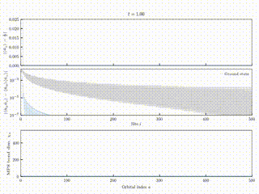

# Impurity dynamics using MPS with orbital rotation 
This code is associtated with this paper [Nunez2025](https://doi.org/10.48550/arXiv.2503.13706)



For the simpler **ground state** problem, we are able to solve 1 million orbitals in 1 hour of single core. See the branch [million](https://github.com/yurielnf/noip/tree/million)

## Dependencies
- [ITensor](https://github.com/ITensor/ITensor) for MPS manipulation
- [tdvp]() for bechmarking our code
- [armadillo](http://arma.sourceforge.net/) for linear algebra. Armadillo depends on **blas**, **lapack** (we recommend **mkl**).
- [Catch2](https://github.com/catchorg/Catch2) for testing

## Compiling
- compile the ITensor library at `${HOME}/opt

## Running 
Before running the code you should:
```bash
export LD_LIBRARY_PATH=/opt/intel/mkl/lib/intel64:$LD_LIBRARY_PATH
export MKL_THREADING_LAYER=sequential
```
