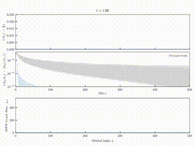

# Impurity dynamics using MPS with orbital rotation 
This code is associated with the paper [Nunez2025](https://doi.org/10.48550/arXiv.2503.13706)




## How it works

The library tracks a small window of *active* orbitals inside a full MPS (which carries the entanglement)
while the remaining orbitals are described by a Slater determinant. This anzats naturally introduce 
the concept of few body state.
After each DMRG or TDVP sweep, 
the one-particle density matrix is diagonalized to find the natural orbitals; the MPS is rotated 
into that basis to minimize both entanglement and activity. Orbitals near half-filling are promoted into the active window, 
and orbitals near occupation 0 or 1 are demoted back into the Slater part. This keeps the active MPS small
even when the total number of orbitals reaches ~1 [million](https://github.com/yurielnf/noip/tree/million)

## Features

What you can do with the library:

- **Find the ground state** of an impurity model with a generic single-particle (hopping) matrix and 
a density-density interaction, scaling to thousands orbitals on a single core.
- **Run real-time dynamics**: for a given initial few body state (example ground state). Internally the dynamics is made in the 
interaction picture of the bath. Convenient analytical rotations make the evolution operator few body as well.
- **Place the impurities anywhere** in the input lattice; the model is automatically transformed to the star geometry. 
Lattices that split into independent sectors (for example separate spin channels) are handled correctly.
- **Treat spin** in two ways: assuming spin-up/down symmetry (so only one spin block is computed), or as two independent spin blocks when that symmetry is absent.
- **Apply local operators (creation,annihilation, etc) on the impurity**, which lets you build spectral (Green's) functions
and run local quench protocols.
- **Measure real-space correlations** `<c_i^dag c_j>` in the original basis at any time — single entries, 
a full matrix, or one row/column — as well as site occupations.

## Example code for ground state
Let's find the ground state of the IRLM model:

$$
H=U\left(n_{0}-\frac{1}{2}\right)\left(n_{1}-\frac{1}{2}\right)+V\left(c_{0}^{\dagger}c_{1}+c_{1}^{\dagger}c_{0}\right)+t\sum_{i=1}^{L-2}\left(c_{i}^{\dagger}c_{i+1}+c_{i+1}^{\dagger}c_{i}\right)
$$

```c++
#include "fbr/fbr_gs.h"
#include <iostream>
#include <iomanip>

using namespace std;
using namespace fbr;

int main()
{
    int L=1000;
    double U=0.5;
    arma::mat K(L,L, arma::fill::zeros);
    {
        for(auto i=1; i<L-1; i++)
            K(i,i+1)=K(i+1,i)=0.5;
        K(0,1)=K(1,0)=0.1;
        K(0,0)=-U/2;
        K(1,1)=-U/2;
    }
    arma::mat Umat(L,L,arma::fill::zeros);
    Umat(0,1)=U;

    // Impurity transforms Kmat to star geometry (impurities at impPos)
    auto model = Impurity {{.Kmat=K, .Umat=Umat, .impPos={0,1}}};

    auto ek=arma::vec {model.param.Kmat.diag()};
    // optional: force impurity occupation |10>
    ek[0]=-10;
    ek[1]=10;
    auto fb=slater<double>(model, ek);
    fb.tol=1e-10;

    auto solver=Fbr_gs(model,fb);

    cout<<"iteration nActive energy time\n"<<setprecision(12);
    itensor::cpu_time t0;
    for(auto i=0;i<100;i++){
        solver.iterate();
        cout<<i+1<<" "<<solver.fb.nActive()<<" "<<solver.energy<<" "<<t0.sincemark().wall<<endl;
        t0.mark();
    }
    return 0;
}
```
The output is
```bash
iteration nActive energy time(s)
...
96 12 -318.016525257 0.809131
97 12 -318.016525257 0.757191
98 12 -318.016525257 0.754573
99 12 -318.016525257 0.788492
100 12 -318.016525257 0.797586
```
This code is the example [`fbr_gs_irlm.cpp`](example/fbr_gs_irlm.cpp). For the spinful SIAM model, see [`fbr_gs_siam.cpp`](example/fbr_gs_siam.cpp).

## Real-time dynamics

Let's do a quench. We start from a Slater determinant, advance one step at a time, 
reading off real-space observables along the way:

```c++
#include "fbr/fbr_dyn.h"
// ... build K, Umat, model as in the ground-state example ...

auto fb=slater<cmpx>(model, ek);
fb.tol=1e-10;

double dt=0.1;
auto solver=Fbr_dyn(model,fb,dt);

cout<<"time energy <n0> <cd> nActive\n"<<setprecision(12);
for(auto i=0; i*dt<L; i++){
    solver.iterate({.max_bond_dim=2048, .epsilonM=1e-4});
    double n0 = solver.correlator(0,0).real();      // impurity occupation
    double cd = 2*solver.correlator(0,1).real();     // impurity-bath coherence
    cout<<(i+1)*solver.dt<<" "<<solver.energy<<" "<<n0<<" "<<cd<<" "<<solver.fb.nActive()<<endl;
}
```

A per-step control selects the bond dimension, the local evolution accuracy, and an optional subspace expansion; the same kind of control tunes the ground-state sweeps. See [`fbr_dyn_irlm.cpp`](example/fbr_dyn_irlm.cpp).

## Spin variants (SIAM)

For models with spin you describe the impurities by listing them from the outermost up orbital through the impurities to the outermost down orbital (extra non-interacting "buffer" orbitals may be included); up/down membership is inferred from the lattice connectivity. Two regimes are supported:

- **Spin-flip symmetric** (`spin_symmetric`) — up and down are equivalent, so only one spin block is computed. See [`fbr_gs_siam.cpp`](example/fbr_gs_siam.cpp) and [`fbr_dyn_siam.cpp`](example/fbr_dyn_siam.cpp).
- **Generic spin (block)** (`spin_block`) — the two spin blocks are handled independently, for cases without spin-flip symmetry. See [`fbr_dyn_siam_block.cpp`](example/fbr_dyn_siam_block.cpp).

The layout is part of the model: `ImpurityParam::layout` selects the chain geometry `toStar()` produces, and `slater<T>(model)` builds a matching initial state. The spinless case is `leading`, the default.

```c++
#include "fbr/fbr_gs_spin.h"
// SIAM: U between the up impurity (site 0) and dw impurity (site 1)
arma::mat Umat(L,L,arma::fill::zeros);  Umat(0,1)=U;
auto model = Impurity {{.Kmat=K, .Umat=Umat, .impPos={0,1}, .layout=spin_symmetric}};

auto fb=slater<double>(model, ek);   // ek defaults to param.Kmat.diag()
auto solver=Fbr_gs_spin(model,fb);
for(auto i=0;i<100;i++) solver.iterate();
double n0 = solver.fb.correlator(0,0);     // impurity occupation
```

## Examples

All example sources live in [`example/`](example/) and build to one binary each under `build/example/`.

| Example | Model / mode |
|---|---|
| `fbr_gs_irlm` | Ground state, spinless IRLM |
| `fbr_gs_siam` | Ground state, SIAM (spin-flip symmetric) |
| `fbr_dyn_irlm` | Dynamics, spinless IRLM (complex MPS) |
| `fbr_green_irlm` | Green function G(0,0), G(0,1) vs the exact non-interacting result |
| `fbr_dyn_siam` | Dynamics, SIAM (spin-flip symmetric) |
| `fbr_dyn_siam_block` | Dynamics, SIAM (generic spin / block) |
| `fbr_dyn_siam_center` | Dynamics, SIAM with impurity kept at the chain center |
| `fbr_dyn_ns_siam`, `fbr_dyn_ns__man_siam` | Dynamics, SIAM variants |

## Dependencies
- [ITensor](https://github.com/ITensor/ITensor) for MPS manipulation
- [TDVP](https://github.com/ITensor/TDVP) for bechmarking our code
- [armadillo](http://arma.sourceforge.net/) for linear algebra. Armadillo depends on **blas**, **lapack**.
- [Catch2](https://github.com/catchorg/Catch2) for testing

## Compiling
1) Install your favorite `blas`/`lapack` library (for instance [mkl](https://www.intel.com/content/www/us/en/developer/tools/oneapi/onemkl-download.html), which is faster) including their `-dev` versions.
Specially for `mkl`, we need to export its path:
```bash
export MKLROOT=/opt/intel/oneapi/mkl/2024.2
```

2) Download the [ITensor](https://github.com/ITensor/ITensor) library to `${HOME}/opt` (our cmake links to this place) and compile it following `INSTALL.md`

3) Replace the line 371 of `itensor/mps/dmrg.h` saying `const int N = length(psi);` to
```c++
const int N = args.getInt("MaxSite",length(psi));
``` 

4) Download the [TDVP](https://github.com/ITensor/TDVP) library to `${HOME}/opt`

5) Compile our library:
```bash
git clone https://github.com/FastQuantum/impurityMPS.git
mkdir build
cd build
cmake ..
make -j4
``` 

## Running 
You will get a binary file per example, so you can type for instance
```bash
build/example/fbr_gs_irlm
```
We have tested the programs with one core, so we recommend before running
```bash
export OMP_NUM_THREADS=1
export OPENBLAS_NUM_THREADS=1
export MKL_THREADING_LAYER=sequential
```
## Adding your application
Now you can add your own application in the folder `impurityMPS/example` and recompile
```bash
cd build
cmake ..
make -j4
```
The new binary will appear at `build/example`.
